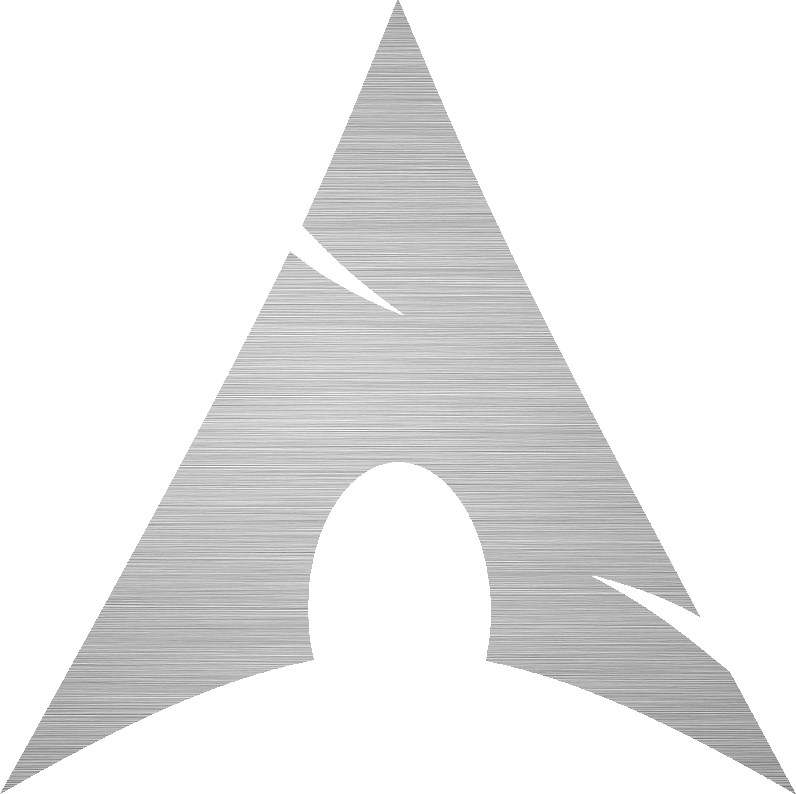

# SilverArch

Elegancy. Essential. It works!



## Description

### Definition

SilverArch is an operating system based on [ArchLinux](https://archlinux.org/) and inspired on [Fedora SilverBlue](https://silverblue.fedoraproject.org/).

### Introduction

- Reasons to use SilverArch
	1. SilverArch is a rolling release Linux distro.
	1. SilverArch is based on ArchLinux operating system.
	1. SilverArch is inspired on Fedora Silverblue concept.
	1. SilverArch is up to run applications on sandbox by default.
	1. SilverArch supports others Linux distros packages by containerization methods.
    1. SilverArch brings a clean workspace.
	1. SilverArch is a step ahead managing programming languages.
	1. SilverArch creates auto backups and it is up to rollback them if you want it.
	1. SilverArch saves a lot of storage on hard disk.
	1. SilverArch is full customizable according to user's tastes.
    1. SilverArch respect your freedom.
	1. SilverArch is open source.
    
### Missions and values

- Missions
	1. Focus user's time using the operating system. Not fixing it.
	1. Encouraging rolling release method to dedicated operating system for desktops.
	1. Encouraging sandbox applications to be used by default.

- Values
	1. Freedom operating system usage.

### Rolling released distro

SilverArch is always up to the latest operating system version, it uses a bleeding edge development model. In others words the operating system receives continuos updates right after it is ready to be applied.

### Based on ArchLinux

ArchLinux core is known by the users communities to be the first place where the softwares updates get available. With an extensive software catalog by default and a lot of more to check them out from ArchLinux User Repository (AUR).

### Similarities between SilverArch and Fedora SilverBlue (EDITING)

<!--
???
-->

#### SilverArch file system tree

SilverArch is inspired on Fedora Silverblue file system tree whose migrates the `/home/` path to `/var/home/` directory. This new structure takes advantage to backup the operating system isolating the user's files from the systems files. The same thing happens to `/sbin/` which has been moved to `/usr/sbin/` path directory.

#### SilverArch symbolic links

The mechanism SilverArch has been taken to improve the compatibility between the new file system and the traditional one is creating symbolic links. So, the software applications and the script files gets 100% sure they are going to work with any source code changes by their developers. So, there is no need to worry about it.

<!--
- Check the SilverArch symbolic links on the following table:

|Origin             |Destiny
|---                |---|
|``|``
|``|``
|``|``
|``|``
|``|``
|``|``
|``|``
|``|``
|``|``
-->

#### SilverArch package manager

SilverArch integrates the package manager and [Timeshift](https://github.com/teejee2008/timeshift) system tools to make a similar work as RPM-OsTree does on Fedora Silverblue, but so much better. Check this comparative below:
    1. First of all SilverArch does not need to reboot the machine for backing up the full operating system and applying the new settings.
    1. User does not need to wait a very long, long time for installing the software packages from a package manager.
    1. SilverArch extends the backup functionality to Flatpak applications too. In case of Fedora Silverblue it is restrict only to RPM-OsTree.

In the follow sections it is possible to check source codes examples about this implementation

- Flatpak


```bash
#!/usr/bin/env sh

#Uninstallation procedure
flatpak --user uninstall $@ && \
	timeshift --btrfs && \
	timeshift --create-backup "Uninstalling $@..." 2>& /dev/null && \
	echo -e "Done!"

#Installation procedure
flatpak --user install $@ && \
	timeshift --btrfs && \
	timeshift --create-backup "Installing $@..." 2>& /dev/null && \
	echo -e "Done!"	
```

- PacMan

```bash
#!/usr/bin/env sh

#Uninstallation procedure
pacman -R $@ && \
	timeshift --btrfs && \
	timeshift --create-backup "Uninstalling $@..." 2>& /dev/null && \
	echo -e "Done!"

#Installation procedure (from ArchLinux repositories)
pacman -S $@ && \
	timeshift --btrfs && \
	timeshift --create-backup "Installing $@..." 2>& /dev/null && \
	echo -e "Done!"
	
#Installation procedure (from local packages)
pacman -U $@ && \
	timeshift --btrfs && \
	timeshift --create-backup "Installing $@..." 2>& /dev/null && \
	echo -e "Done!"
```

### Sandbox applications (EDITING)

<!--
FIREJAIL, FLATPAKS
-->

### Install packages such as `.deb` and `.rpm` extensions on SilverArch

SilverArch brings [DistroBox](https://github.com/89luca89/distrobox) and [Podman](https://podman.io/) system tools by default. These applications working together make the user to be able to use others Linux distros such as [Debian](https://www.debian.org/), [Fedora](https://start.fedoraproject.org/), [OpenSUSE](https://www.opensuse.org/) and [Ubuntu](https://ubuntu.com/) from a containerized method whose creates the hole file system tree structure according to the distro needs. It has included the package managers such as `APT`, `DNF` and `Zipper` while sharing the Linux kernel and the `$HOME/` path directory between the container and the host operating system.

Once you have installed an application inside a containerazed distro, this software can be run with graphical interface and audio sound with any additional setup. It is also possible to integrated the application with the host operating system exporting the desktop file to the application menu.

### Clear workspace concept

SilverArch brings a clean workspace with no unneeded softwares installed by default. That is it!

### Managing programming languages

SilverArch supports any different versions of many programming languages and compilers at the same time without messing up the operating system file tree structure. It does not break any software dependencies while installing or uninstalling them because SilverArch has a dedicated workspace for these procedures.

Once SilverArch uses [ASDF](https://asdf-vm.com/) system tool running on background it is possible to install [Java](https://www.java.com/), [NodeJS](https://nodejs.org/), [Python](https://www.python.org/) and many more programming languages on the operating system. It is also possible to set a different compiler version for each different project. For example, the user can set Python 3.10.2 as system default version and Python 3.6 version to a single project. Awesome!

### Backups and operating system rollbacks

SilverArch auto creates backups of the hole operating system when installing or uninstalling softwares with the default system package manager (PacMan). This procedure enables the user to rollback for a previous state version in case of troubles. To restore a backup the user must set the previous snapshot he wants to revive (rebooting the machine is required to apply these settings).

In case the user restore a wrong snapshot it is possible to come back to the original version. Restoring snapshots does not delete them unless the user does this procedure manually.
	
SilverArch enables the user to check the files from the previous snapshots versions without even to restore them (including copying and editing). Once SilverArch uses Times/hift system tool on background for managing the system backup and BTRFS is set to be the default file system, backing up or restoring the hole operating system is almost instantaneity. Sounds like magic but it is real!
	
Backup is never too much but it hurts a lot of time. How about backing up the full operating system without even needing to remember about this?

### Storage

SilverArch saves hard disk spaces when creating backup snapshots because only the diff from the modified files get saved storage. In other words it means the SilverArch does not copy the hole files, only the modified part is saved.

### Installation setup customization possibilities

During the SilverArch installation setup it is possible to install possible to install:
	- Audio server
		1. [Advanced Linux Sound](https://wiki.archlinux.org/title/Advanced_Linux_Sound_Architecture).
		1. [PulseAudio](https://wiki.archlinux.org/title/PulseAudio).
		1. [Pipeware](https://wiki.archlinux.org/title/PipeWire).

	- Desktop environments
		1. [Deepin](https://wiki.archlinux.org/title/Deepin_Desktop_Environment).
		1. [Gnome](https://wiki.archlinux.org/title/GNOME).
		1. [i3](https://wiki.archlinux.org/title/i3).
		1. [Plasma](https://wiki.archlinux.org/title/KDE).
		1. [XFCE](https://wiki.archlinux.org/title/xfce).

	-  Drivers
		1. [Graphics]().
		1. [Printers]().
		
	- Windows server
		1. [X.org](https://wiki.archlinux.org/title/xorg).
		1. [Wayland](https://wiki.archlinux.org/title/wayland).


### We respect your choices

SilverArch does not collect or intercept your data. Any kind of telemetry are installed by any software which is installed by default. By the way if the user wants to install these kind of softwares there is no forbidden for this procedure. We understand the users have their own reasons about to do what they are doing and also known they can be penalty responsibility by their actions. SilverArch has been made to work, not to judge.

Unless the user really wants to do this, SilverArch is an unbreakable operating system. SilverArch respects the users choices about changing the operating system settings about their tastes. In this scenery SilverArch cannot promise the unbreakable concept is going to be fire proofed.